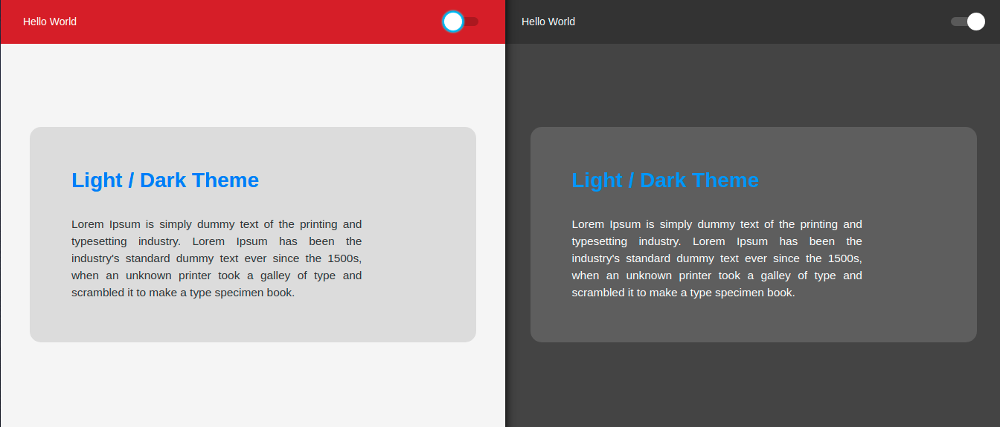

# Switch Themes 

Switch light and dark theme using Reactjs and Typescript

## How to run

1. `git clone` this repository
2. Make sure you have `yarn` installed
3. Inside project folder run the command `$ yarn` to download dependencies
4. Run the project with `$ yarn start`

## Project Overview

Youtube video tutorial: https://youtu.be/ngVU74daJ8Y 

### keep coding!